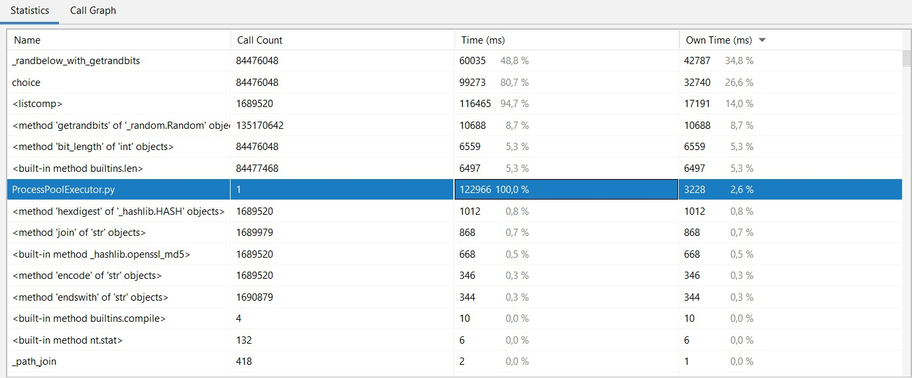
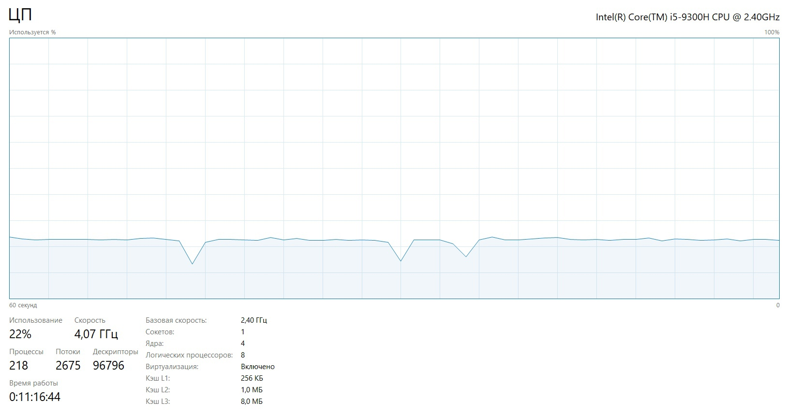

# IO-bound. Проверяем ссылки на страницах Википедии
## Синхронная проверка в 1 поток

Время работы: 
1151963 миллисекунды ≈ 19 минут 12 секунд.

Загрузка памяти: 

Загрузка процессора: 

## ThreadPoolExecutor

### max_workers = 5

Время работы: 
406331 миллисекунд ≈ 6 минут 46 секунд

Загрузка памяти: 

Загрузка процессора: 

Загрузка сети Internet: 

### max_workers = 10

Время работы: 
233960 миллисекунд ≈ 3 минуты 54 секунды

Загрузка памяти: 

Загрузка процессора: 

Загрузка сети Internet: 

### max_workers = 100

Время работы: 
179049 миллисекунд ≈ 2 минуты 59 секунд

Загрузка памяти: 

Загрузка процессора: 

Загрузка сети Internet: 

**Загрузка памяти не зависит от количества "воркеров".
При увеличении числа "воркеров": загрузка проццесора - увеличивается, загрузка сети Internet - увеличивается, время работы программы - уменьшается.
Используя ThreadPoolExecutor время работы уменьшается в несколько раз.**

# CPU-bound. Генерируем монетки
## Генерация монетки на 1 ядре

Время работы: 
155723 миллисекунды ≈ 2 минуты 36 секунд

Загрузка процессора: 

Загрузка памяти: 

## ProcessPoolExecutor
### max_workers = 2

Время работы: 
58010 миллисекунды ≈ 58 секунд

Загрузка процессора: 

Загрузка памяти: 

### max_workers = 4

Время работы: 
126990 миллисекунды ≈ 2 минуты 7 секунд

Загрузка процессора: 

Загрузка памяти: 

### max_workers = 5

Время работы: 
138878 миллисекунды ≈ 2 минуты 18 секунд

Загрузка процессора: 

Загрузка памяти: 

### max_workers = 10

Время работы: 
122966 миллисекунды ≈ 2 минуты 3 секунды

Загрузка процессора: 

Загрузка памяти: 

### max_workers = 100

Ошибка: 

**Загрузка памяти не зависит от количества "воркеров".
При увеличении числа "воркеров": загрузка проццесора - увеличивается, время работы программы - сначала уменьшается, но когда число "воркеров" достигает числа ядер процессора - не изменяется.**